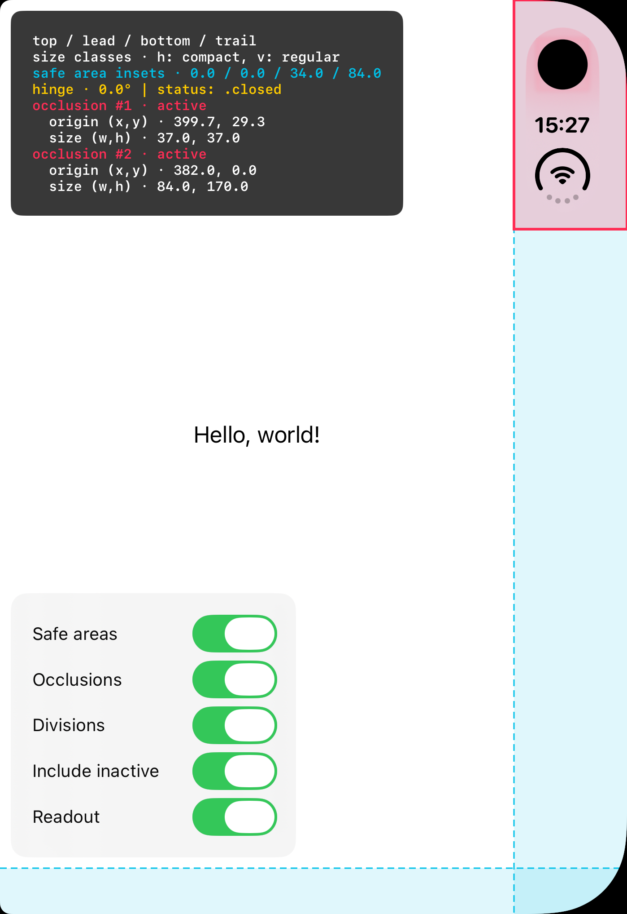
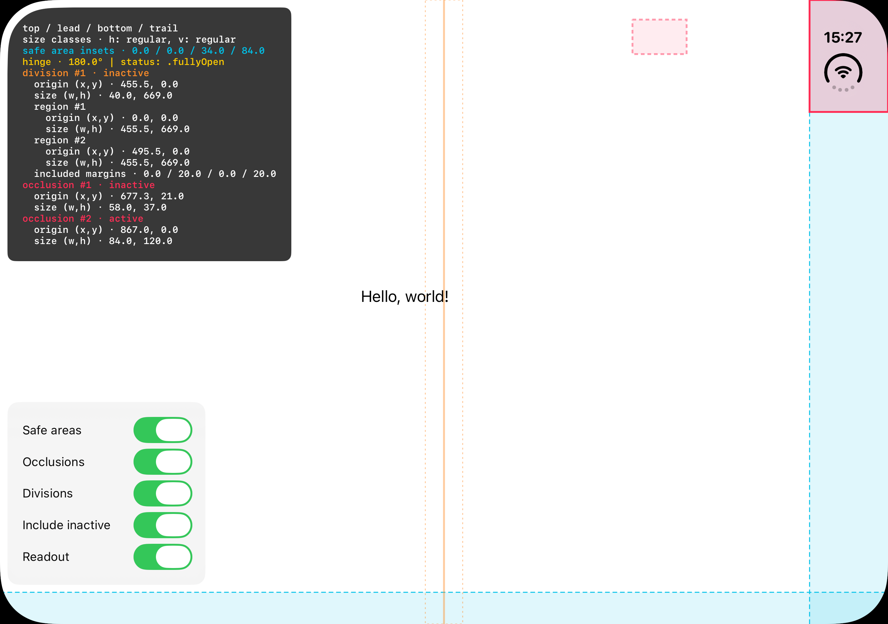

# LayoutScope

A small SwiftUI debug overlay for inspecting window layout on iPhone Duo and other
iOS devices. It shows safe areas, reserved regions, size classes, and hinge state.
No external dependencies; both modifiers are no-ops in release builds.

Requires **Xcode 27.1+, Swift 6.2+, and iOS 26+**. Hinge and reserved-region
readings require iOS 27.1; hinge data depends on the device.

<p>
  <a href="Images/duo-closed.png"></a>
  <a href="Images/duo-open.png"></a>
</p>

## Install in Xcode

1. Choose **File → Add Package Dependencies…** and enter:
   ```text
   https://github.com/danmunoz/LayoutScope.git
   ```
2. Select **Up to Next Major Version**, set the minimum version to **1.0.0**, then
   choose **Add Package**. SwiftPM resolves this version range from the repository's
   release tags, so the `1.0.0` tag must be published before the dependency can resolve.
3. Add the **LayoutScope** library product to your app target.

## Use

Import `LayoutScope` and attach the modifier **once to the root view inside each
`WindowGroup`**, in your app's scene declaration:

```swift
import LayoutScope
import SwiftUI

@main
struct ExampleApp: App {
    var body: some Scene {
        WindowGroup {
            ContentView()
                .layoutScopeOverlay()
        }
    }
}
```

The bottom-left switches show or hide safe areas, inactive regions, occlusions,
divisions, and the entire readout. Inactive regions are included by default;
start without them using `.layoutScopeOverlay(includeInactiveRegions: false)`.
The guides and readout pass touches through to your app; only the switches intercept them.

To inspect an individual view instead, use `.localLayoutScopeOverlay()` inside
the container you want to measure. It also shows content margins in green;
already-consumed safe-area insets may be zero. This local helper has no switches
and excludes inactive regions by default.

## Readout

- **Size classes:** `h` is horizontal; `v` is vertical.
- **Safe area:** insets in top / leading / bottom / trailing order, shown in cyan.
- **Hinge:** angle in degrees and current status, or awaiting/unavailable readings.
- **Regions:** pink occlusions and orange divisions, with active/inactive state,
  origin `(x, y)`, and size `(w, h)`. Divisions also list the content areas on both
  sides. Any included margins are already part of the region frame.

Dimensions are in points. Window coordinates start at the top-left; local
coordinates are relative to the inspected view.

To try it, open `LayoutScopeDemo/LayoutScopeDemo.xcodeproj` and run the
**LayoutScopeDemo** scheme on the Duo simulator. The screenshots above are from this demo.

## License

[MIT](LICENSE).
